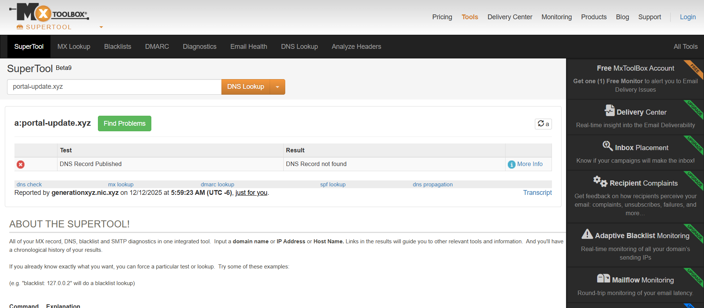

#  INCIDENT ANALYSIS REPORT - RAPID PHISHING

##  1) Context and Indicator of Compromise (IoC)

* Alert Scenario: Simulation of a critical Service Desk alert regarding
a user who received a suspicious email inviting them to log in to a
financial portal for a "security update".
*  IoC Analyzed: https://finances.portal-update.xyz/login
*  Objective of the Analysis: To confirm the malicious nature of the
IoC, assess the threat and document the attack infrastructure.

##  2) Technical Analysis and Investigation

### A. Threat Intelligence Triage

The initial analysis was conducted to assess the immediate reputation of
the IoC:

* VirusTotal (VT): The domain recorded a detection score of 0 out
of 98 search engines. Only Forcepoint ThreatSeeker classified it
as Suspicious.
* Analytical Conclusion: This low score (0/98) strongly suggests
that the domain is very recent or targeted and has not yet been
indexed by most blacklists. The Suspicious classification confirms
abnormal activity and the need for further investigation.

* URLScan.io: The sandbox behavioral analysis attempt
immediately failed with an HTTP 400 error - DNS Error: Could not
resolve domain.
* Analytical Conclusion: The site could not be loaded. This
indicates
that the domain is inactive or has been removed,
which is strong evidence of an ephemeral attack infrastructure (set
up and removed very quickly to cover its tracks).

### B. OSINT and Infrastructure Analysis (DNS/Whois)

The investigation focused on the root domain (portal-update.xyz)
to assess its legitimacy and infrastructure:

*  Whois Lookup: The search returned no WHOIS data for the
domain.
* Analytical Conclusion: The absence of Whois data is
common in phishing attacks, confirming the attacker's
intention to use disposable infrastructure and to mask the
owner's identity.

* MXToolbox (DNS Lookup A Record): The test confirmed
that no DNS (A Record) was found for the domain.
* Analytical Conclusion: The absence of a DNS record
confirms that the domain is unresolvable and functionally
dead. The attacker's infrastructure has been neutralized or
was never fully operational.

## 3) Incident Conclusion and Threat Assessment

* Nature of the Attack: Phishing by Typosquatting (imitation of a
legitimate domain with portal-update) and use of an Ephemeral
Infrastructure.

* Analyst's Verdict: Despite the domain's inactivity, the data correlation
(Score 0/98 + Immediate Inactivity) indicates that the IoC is Highly
Malicious and has been used in a short-term phishing campaign to cover
its tracks.

* Proof of the Escape: The attacker managed to bypass the majority of
blacklists (0/98) and took down the site within minutes of sending it.

## 4) Recommendations and Incident Response

The following actions are required to neutralize the threat and strengthen
the defense:

1.​ Response T1 (Junior Analyst): Close the ticket with the IoC
classified as Malicious and document the reason for the domain
inactivity.

2.​ T2 Blocking Measure: Add the portal-update.xyz domain to the
firewall and web proxy blacklist for all users, as a preventative
measure against reactivation.

3.​ T2 Threat Hunt (Email Hunt): Launch an immediate search
across email systems (Exchange Online, M365 Defender) to find
and quarantine all emails containing the IoC.

4.​ Awareness Training: Update training modules to raise user
awareness of generic (.xyz) domains in update emails.

## 5) Summary and Conclusion of the Incident

The finance.portal-update.xyz domain is classified as a Confirmed
Malicious IoC despite being inactive at the time of analysis.

* Evidence of Phishing: The choice of name (portal-update) and
the generic extension (.xyz) confirm a typosquatting attempt aimed
at impersonating a legitimate financial service.

* Evasive Behavior: The zero detection score on most VirusTotal
engines and the immediate inactivity of the infrastructure (DNS
error on URLScan.io and MXToolbox) demonstrate the use of an
ephemeral attack infrastructure designed to:

1.​ Bypass automatic blacklists.

2.​ It must be removed immediately after the email is sent to
erase all traces.

* Verdict: The threat is classified as HIGH due to the proven
malicious intent and high level of evasion. Although the IoC is
currently inactive, proactive blocking measures are necessary to
prevent the domain from being reactivated.

